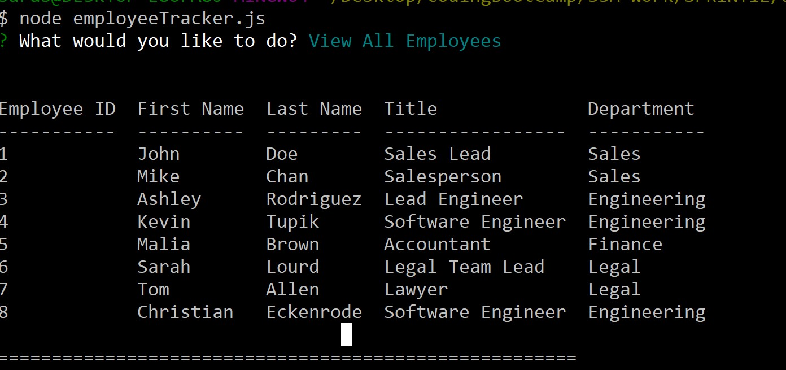

# EmployeeTracker
[](https://opensource.org/licenses/MIT)

## Description
This application is a rudimentary CMS that allows a company to manage its employee database. The user can view employees, departments, and jobs; add employees, departments, and jobs; and update an employee's job.

Node:



For a brief demo video, see https://drive.google.com/file/d/10UIX3xqSBd36-US3o_K9w-OjmbwiUq2_/view. 

---

## Installation
This application requires Node.js and npm. It requires installation of the `mySQL` and `inquirer` modules. To install modules, simply navigate into the direcotry where the employeeTracker.js file is saved and type the following into the command line:

```
npm install
```

---

## Usage
After `mySQL` and `inquirer` are installed, the database with tables needs to be created using employeeTrackerSchema.sql. The user can populate the tables using mySQL code like in employeeTrackerSeeds.sql or just use the app.

To run the program in Node, type the following into the command line:

```
node employeeTracker.js
```
Then type your answers to the prompts. As you answer questions, the database will be populated or updated with the provided input.

---

## Questions
Please feel free to contact me with any questions about this project.

Name: Sara McGuinn

GitHub: saramcguinn

Email: sara.mcguinn@gmail.com


